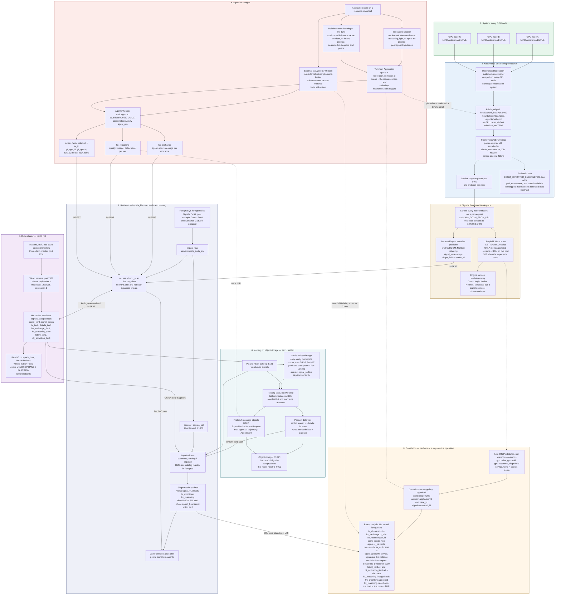

# DCGM, the warehouse, and agent exchange

One picture of GPU telemetry in a **cluster** — not only this node — through
the Kubernetes DCGM exporter, the Signals federated workspace, and the tiered
warehouse. Hot rows live on a **Kudu cluster**. Settled rows live as
**Parquet** Iceberg data files, and the message-preserving records live as
**Protobuf** objects, on the same object store. Readers use one surface:
PostgreSQL [`impala_fdw`](../components/impala_fdw.md) over Impala views that
union Kudu and Iceberg. Agent exchanges (`hx_exchange`, `hx_reasoning`) stay
on the same `tx_id` and the same clock as the device samples, so an
interactive session or a reinforcement-learning / fine-tune step can be
read back with the watts and faults it caused.

The fence below is plain Mermaid (`flowchart`). GitHub renders it. Copy the
fence, without the `mermaid` tag line, into any renderer that accepts
GitHub's flowchart syntax. Line breaks inside nodes are ` `. Subgraph
titles and node labels that contain punctuation are double-quoted. There
is no `%%{init}%%` directive, no HTML beyond ` `, and no diagram type
other than `flowchart`.

## Two ways out of the exporter

The exporter does not write the warehouse. Nothing in this path is a TSDB.

| Path | What happens | Retained? |
|------|----------------|-----------|
| Live yield | Signals engine `signals.telemetry.dcgm_otel` GETs `/metrics` once per request and returns OTLP JSON on `:9410/v1/metrics`. `Status.surfaces` advertises that URL with `kind=telemetry`. | No. Empty consumer, no work beyond the idle exporter. Down exporter is HTTP 503. |
| Warehouse land | A workspace writer (the Gaius ingest is the reference) parses the same Prometheus text at the field's native width and `INSERT`s `signal_tier0` through `impala_fdw` `kudu_scan`. `signal_series.src = 0` and `dcgm_field` name the DCGM counter. | Yes. Hot on Kudu, then settled. |

`src` on a sample is `0` DCGM, `1` vLLM or trainer, `2` engine, `3` host.
Device cost and application counters share `epoch_hour` and `ts_ns`. They
are not two pipelines.

Tier-0 inserts in this picture are `impala_fdw` `kudu_scan` (the same
foreign tables the hot scan reads). `signals.ops.warehouse.ImpalaWarehouse`
opens HiveServer2 directly; that sidecar is not the pattern drawn here.

## How a sample stays on a session

There is no foreign key from `signal_tier0` to `tx`. Association is a read
over the views in band 7. For one operation:

1. The operation is one `tx_id` (UUIDv7). `tx`, `details.t`, `hx_exchange`, and `hx_reasoning` use that id.
2. `details` for that id names the placement: `yk_app_id` (this is `federation.workload_id` and the YuniKorn application id), `yk_queue`, `run_id`, `model`, `flow_name`.
3. Interactive work and a fine-tune or RL step differ by **queue leaf and product**, not by storage. Interactive leaves are `root.internal.inference.instruct`, `reasoning`, `light`, and `agent-rtc` (Hermes WebRTC, one GPU while the session runs). The trajectory product is `{peer}.agent.trajectories`. Training-shaped work uses `extract`, `medium`, or `heavy` (for example `aegir.models.bespoke`). There is no project queue and no `root.gaius`.
4. An external leaf (`root.external.subscription.rate-limited`, `token-metered`, `rate-metered`) records `hx_*` and claims **no** GPU. It has no `src = 0` rows.
5. YuniKorn places a GPU Application on a node and a device ordinal. The retained sample stores the device as `signal.gpu` and the instance — the node, when the cluster writer stamps one — as `signal.inst`. Hostname and GPU UUID stay on the live OTLP point (`gpu.hostname`, `gpu.uuid`). They are not columns of `signal_tier0`.
6. Device samples for the operation are `signal` rows with `src = 0`, that `gpu` and `inst`, the same `epoch_hour`, and `ts_ns` between the minimum and maximum `ts_ns` of the `hx_*` rows for the `tx_id`. `src = 1` rows in that window are the trainer or vLLM counters beside the device.
7. When the operation recorded model state, `latent_tier0.ref` and `clt_activation_tier0.ref` carry the same trace id. `hx_reasoning.lineage` carries the OpenLineage run id when the review wrote one. `hx_reasoning.trace` carries the brief, or the object URI of the Protobuf trajectory (`zndx.agent.v1`, ATIF on the object plane).
8. The signals-ui merge key `openlineage.runId · yunikorn.applicationId · otel.trace_id · signals.workload_id` is the control-plane name for the same association. `otel.trace_id` is not its own warehouse column.

`hx_exchange.actor` is the speaker (the column is not named `role`). Kudu
string cells used by `hx_*` are capped at 64KiB; a longer trace is the
Protobuf object, and the cell holds the URI.

## Parquet, Protobuf, and the Iceberg spec

Tier-1 **rows** that Impala scans are Parquet data files under the Iceberg
table (`write.format.default=parquet`). Tier-1 **messages** that must stay
in their wire shape are Protobuf objects on the same bucket: an OTLP
metrics export (`opentelemetry.proto.metrics.v1`) and a `zndx.agent.v1`
trajectory. Iceberg finds the Parquet files through JSON table metadata
and **Avro** manifests. Manifests are not Protobuf.

Polaris (`:8181`) is the REST catalog. The bucket is
`s3://signals-dataproducts/`. On this node that API is RustFS `:9010`.

Writers do not `DELETE`. After a closed range is copied and the Impala
count matches, tier upkeep runs `DROP RANGE PARTITION` on the Kudu tables
(`impala_fdw_exec` for the range DDL). The views hide tier-1 hours that
are still present in tier 0, so a settled-but-not-yet-dropped range is
not counted twice.

## This node and a real cluster

The diagram is the cluster. This workstation is the same graph with the
widths turned down.

| Piece | Cluster | This node |
|-------|---------|-----------|
| DCGM | DaemonSet pod on every GPU node; scrape each Service endpoint | `hostPort 9400`, scrape `127.0.0.1:9400` |
| Exporter labels | Set `DCGM_EXPORTER_KUBERNETES=true` so a sample names the pod | Shipped manifest sets `false` (node-scoped watts) |
| Kudu | 3 masters, tablet servers, replication 3 | 1 master `:7051`, 1 tserver, `kudu.num_tablet_replicas=1` |
| Object store | S3-compatible bucket `signals-dataproducts` | RustFS `:9010` |
| Catalog | Polaris REST | Polaris `:8181` / admin `:8182` |
| SQL front door | Postgres + `impala_fdw` on each peer | Signals `:5455`, Gaius `:5444` |
| Identity | Kerberos GSSAPI, one principal through Postgres, Impala, and Kudu | Realm `DEV.VISTA.ZNDX.ORG` |

The lab settle writer (`scripts/signal_settle.py`,
`scripts/gpu_metrics_tier_up.py`) still emits **HDF5** (`.h5`,
`FileFormat.HDF5`, `write.format.default=hdf5` on `signal_tier1`) and
Impala reads those files with the in-fork HDF5 scanner. That is the
workstation analog. It is not the layout drawn above. The cluster
blueprint's scanned files are Parquet; Protobuf is the message objects
beside them.

## Where the names are defined

| Name in the diagram | Defined in |
|---------------------|------------|
| `dcgm-exporter` DaemonSet, counters, `:9400` | `zarf/federation/manifests/telemetry/dcgm-exporter.yaml` |
| OTLP yield `:9410/v1/metrics` | `src/signals/telemetry/dcgm_otel.py` |
| Telemetry surface | `src/signals/engine/s2s.py` (`kind=telemetry`) |
| `signal_tier0` / `signal` foreign tables | `config/platform/signal-fdw.sql` |
| `tx` / `details` / `hx_*` views | `config/platform/data-products-views.sql` |
| Tier-0 DDL, week ranges, no `DELETE` | `config/platform/data-products-kudu.sql` |
| Resource-class leaves | `config/scheduler/resource-classes.md` |
| `tx_id`, `hx_*`, trajectory product | `components/signals-protocol/specification/protocol/data_products.md`, `agent_grpc.md` |
| FDW `kudu_scan` vs `impala_sql` | [Impala FDW](../components/impala_fdw.md), [Query engine](../architecture/query-engine.md) |

Logical warehouse names and the fact-log shape:
[Data products history](../architecture/data-product-history.md).
The exporter's place on the critical plane:
[Critical plane](../architecture/stack-critical-plane.md).
