# Nautilus FSM and the Brier ledger

Nautilus is the deterministic supervisor beside each engine. It does not
host a model. The project ships a `Supervisor` instance; the protocol
`zndx.supervision.v1` is only the grammar. Nautilus loads that instance,
stamps a position on every forecast, and scores Brier inside the epoch
`spec_version` + `engine_build`. A forecast answers to **its phase's
gate**, not to a later failure in the same run.

This is not the IT-ops method catalog. That ledger
([IT-ops FSM and Brier ledger](../architecture/ops-fsm.md)) scores probes
in `build/state/ops-observations.jsonl` by method state and implicit
K8s/YuniKorn state. Nautilus writes `nautilus_events`, `nautilus_positions`,
and `nautilus_backlog`.

The fence below is plain Mermaid (`flowchart`). GitHub renders it. Paste
the contents into a Mermaid renderer, or keep the fence in a GitHub
markdown file. Line breaks inside nodes are `<br>`. Subgraph titles and
node labels that contain punctuation are double-quoted. There is no
`%%{init}%%` directive, no HTML beyond `<br>`, and no diagram type other
than `flowchart`.

```mermaid
flowchart TB
  subgraph spec ["1. Instance — grammar here, project only in the textproto"]
    textproto["Supervisor textproto<br>config/supervision/project.textproto<br>LoadSpec rejects the whole file on one validation failure"]
    epoch["Scoring epoch<br>spec_version plus engine_build<br>an unrelated source commit does not reset the ledger"]
    tree["Supervision tree<br>parent and depends_on<br>ONE_FOR_ONE, ONE_FOR_ALL, REST_FOR_ONE, or NONE"]
    machine["Machine on one process<br>phases are a total order"]
    objective["Objectives on the surfaced result<br>mechanics paired with intent<br>every gate must pass"]
    budgets["Budgets<br>recycle_k per window, then cooldown<br>exhaustion trips a breaker, never a silent retry"]
    textproto --> epoch
    textproto --> tree
    textproto --> machine
    textproto --> objective
    textproto --> budgets
  end

  subgraph health ["2. Process health — a pure function of the snapshot"]
    snap["One process in the snapshot"]
    starting["STARTING<br>inside warmup_seconds<br>never a miss"]
    serving["SERVING<br>observed and making progress"]
    missing["MISSING<br>past warmup, not observed past the net"]
    stalled["STALLED<br>observed, no progress past the net<br>progress beats wall-clock"]
    unsupervised["UNSUPERVISED<br>reports_positions and never called ReportPosition<br>surfaced, never inferred around"]
    unobs["UNOBSERVABLE<br>the observing engine is MISSING<br>nothing can be said"]
    snap --> starting
    snap --> serving
    snap --> missing
    snap --> stalled
    snap --> unsupervised
    snap --> unobs
  end

  subgraph phases ["3. Phase gate — a hierarchy, not a flat window"]
    phaseA["Phase A<br>named source steps"]
    gateA["Gate A closes phase A<br>GateKind plus concrete params<br>no threshold means no gate"]
    horizonA["Horizon of phase A<br>window_seconds<br>resolve_within_phase_only"]
    phaseB["Phase B<br>resolves the claim that gate A held<br>cannot resolve forecasts stamped in A"]
    gateB["Gate B<br>JUDGE_RUBRIC with judge_final_call is GOLD<br>the supervisor's own check is SILVER at best"]
    intent["ResourceIntent emitted on phase entry<br>occupancy, floor, priority<br>zero floor on exit, ahead of the claim"]
    phaseA --> gateA --> horizonA --> phaseB --> gateB
    phaseA --> intent
  end

  subgraph observe ["4. Observation — Nautilus dials, the engine serves"]
    naut["Nautilus<br>one binary, one instance, one ledger<br>no agent loop"]
    stream["EngineSupervision.Supervise<br>engine death is the stream dropping<br>the engine runs with nobody connected"]
    adapters["SourceKind adapters<br>systemd, Metaflow store, task queue, HTTP<br>Airflow and any foreign store only via the owning engine"]
    report["ReportPosition at each gate boundary<br>REPORTED by the process<br>OBSERVED by an adapter<br>INFERRED carries the least weight"]
    pos["Position<br>process, machine, phase, run_id, step<br>momentum raw here, bucketed at read<br>epoch stamped on the row"]
    textproto -->|"LoadSpec"| naut
    stream --> naut
    adapters --> naut
    report --> naut
    naut --> snap
    naut --> pos
  end

  subgraph act ["5. Directives — Nautilus never kills"]
    trig["evaluate_triggers of the snapshot<br>arming key is trigger plus scope plus bucket<br>never free text"]
    reclaim["ReclaimOrphan<br>silence since last progress, not age since claim<br>a heartbeat after the snapshot voids it<br>a live child refuses it"]
    esc["Escalation is the Overwatch consult<br>the judge stays in the engine<br>judge unavailable is VERDICT_ERROR, not a local fallback"]
    result["DirectiveResult<br>engine dedups on directive_id<br>recycle, reset, hold, and breaker are forecasts"]
    naut --> trig
    budgets --> trig
    trig --> reclaim --> result
    trig --> esc
    esc --> result
  end

  subgraph book ["6. Write-ahead, then the tiered store"]
    wal["SupervisorRecord protobuf first<br>nisshi journal on the object store<br>recording never blocks on the supervised stack<br>buffered_records is the journal lag"]
    drain["Drain into the project warehouse<br>impala_fdw kudu_scan INSERT<br>the project's Postgres, not a peer's"]
    events["nautilus_events_tier0<br>trigger, directive, forecast, resolution<br>p, verdict, outcome_known, outcome, position"]
    positions["nautilus_positions_tier0<br>heartbeat, position, health"]
    cells["nautilus_backlog_tier0<br>one row per workflow, item, Fibonacci slot"]
    views["Logical views nautilus_events, nautilus_positions, nautilus_backlog<br>tier1 Iceberg union is pending<br>until then the views are tier0 only, and no day-drop"]
    wal --> drain
    drain --> events
    drain --> positions
    drain --> cells
    events --> views
    positions --> views
    cells --> views
  end

  subgraph score ["7. Brier — per cell, inside the epoch"]
    cell["Score cell<br>observer, call_site, momentum bucket<br>same spec_version and engine_build<br>position selects which gate may resolve the row"]
    brier["Brier is the mean of (p minus outcome) squared<br>only rows with outcome_known<br>a correction is a new row, latest wins"]
    alpha["alpha = (n/(n+K))*(1-Brier) + (K/(n+K))*prior<br>K = 2, prior = 0.5<br>n = 0 is uncalibrated: risk 0.5, never trusted"]
    promo["Actuation promotion for that scope<br>observe, then propose, then act<br>only as this cell's record earns it<br>the judge of that promotion is a different process"]
    epoch --> cell
    cell --> brier --> alpha --> promo
  end

  subgraph fib ["8. Operations Backlog — Fibonacci hours, not minutes"]
    scales["Two scales, one clock<br>nets, admission, idle: seconds<br>Backlog: the hour"]
    tick["Nautilus.Tick<br>idempotent on the hour<br>a systemd timer is the second hand while the resident runs"]
    slots["Slots 0..9 are Fibonacci hours<br>0, 1, 1, 2, 3, 5, 8, 13, 21, 34<br>computed horizons round DOWN"]
    admit["Slot 0 is first admission<br>time inside the window is the arbiter working, not Backlog time<br>a healthy workflow writes ok here and leaves 1..9 empty"]
    confirm["Slots 1 and 2, both 1 hour<br>miss observed, then confirmed<br>the repeat separates a transient from an open item"]
    chan["The deepest miss selects the channel<br>1 and 2 log, 3 agenda, 5 reminder<br>6 and 8 briefing, 9 discussion"]
    resolved["A later ok resolves the item<br>the history stays"]
    scales --> tick --> slots --> admit --> confirm --> chan
    confirm --> resolved
  end

  machine --> phaseA
  gateA -->|"resolves only forecasts stamped in phase A"| cell
  gateB -->|"resolves the claim that gate A held"| cell
  intent -->|"forecast: share APPLIED within N seconds<br>a dark arbiter makes every peer VERDICT_INCONCLUSIVE"| cell
  pos --> wal
  pos --> cell
  result --> wal
  result -.->|"scored like any other forecast"| cell
  esc -.->|"engine records the judge forecast"| cell
  reclaim -.->|"dry_run records the forecast and does not reset"| wal
  tick --> wal
  views --> reader["Backlog readers<br>Nautilus.Backlog and the engine Backlog RPC<br>the engine still answers when Nautilus is dark<br>a stale last_tick is the signal"]
  peer["A peer Nautilus<br>watches sibling Status<br>writes only its own ledger"]
  peer -.-> wal

  style spec fill:#eef0f8,stroke:#24356b
  style health fill:#e7f6ec,stroke:#1b7a3a
  style phases fill:#f8f1e3,stroke:#8a5a00
  style observe fill:#e7f1fb,stroke:#1d4e89
  style act fill:#fdecea,stroke:#8a2b2b
  style book fill:#f3e8f8,stroke:#5c2d91
  style score fill:#fff6e8,stroke:#8a5a00
  style fib fill:#eef6f8,stroke:#0f5f6b
```



## The phase-gate rule

Forecasts made while a machine is in a phase are resolved against **that
phase's gate**, inside that phase's `Horizon`. With
`resolve_within_phase_only` set, a later phase must not close them. The
gate's own verdict becomes a claim the **next** phase resolves.

That is why "the file downloaded" is not Brier-penalized for a vLLM
failure three phases later, and why the terminal surface verdict can
still resolve the terminal gate. Resolving by proposition text inside a
time window is the failure this rule replaces: a segment-correct claim
was charged for a downstream miss it did not cause.

Positions are the stamp, not a scrape of free text. A process with
`reports_positions` calls `ReportPosition` on each transition. Unknown
process or phase is `Ack.accepted=false`. An adapter may fill
`OBSERVED` (Metaflow steps, Airflow task instances, pg_cron runs).
`INFERRED` is derived, for example lifecycle from timestamps, and weighs
least. `Objective.resolves` (proposition patterns) is transitional and
is retired as the machine starts reporting positions.

A gate with no concrete threshold is not a gate. Where the surface
needs a judgment, `GATE_KIND_JUDGE_RUBRIC` with `judge_final_call` is
tier `GOLD` and Overwatch renders it. The supervisor does not host that
model. Judge unavailable is `VERDICT_ERROR`. A local model's rubric
score is itself a forecast, resolved by the judge's call.

Mechanics and intent are paired objectives. Reaching `end`, a clean task
row, or a file on disk is a forecast that the user receives the intended
artifact. It is not the objective. The audit case is a publish that
stayed green while the surface served three-week-old content.

## How a cell is scored

The cell is `(observer, call_site, momentum bucket)` inside one epoch.
`Position.momentum` is the raw corroboration count. Bucketing happens
at read time, so a counter ticking inside a poll does not mint a new
cell and does not re-arm a trigger. The arming signature is the same
idea: trigger, scope, and bucketed state. Never free text.

For resolved rows in that cell:

```text
Brier = mean( (p - outcome)^2 )
alpha = (n / (n+K)) * (1 - Brier) + (K / (n+K)) * prior
```

`K` is 2 and `prior` is 0.5. `n = 0` returns the prior: risk 0.5, not 0.
An unresolved group is uncalibrated. It is never treated as trusted.
One miss moves the score. It does not change behavior, disable a probe,
or retune a threshold. Divergence is surfaced as a trigger and, when
determinism cannot settle it, as an `Escalation`. The judge is scored
on the same ledger.

Actuation is promoted per process: observe, then propose, then act, only
as that scope's Brier record earns it. The judge of the promotion is a
different process from the supervisor being promoted. Adoption starts at
`RESTART_STRATEGY_NONE` (observe and score, no recycle). The Signals
instance is still there: every process in
`config/supervision/signals.textproto` is `NONE`, and the pinned epoch
is `spec_version` `2026-09-20.1` with `engine_build` `trunk`.

Every side effect is a row. A recycle, a reset, a hold, or a breaker
trip carries the `Position` it was rendered at and is resolved inside
its horizon. `ReclaimOrphan` may be `dry_run`: the forecast is written
and the task is not reset. Nautilus measures silence since the last
progress signal. It does not measure age since claim, and it does not
kill on the clock.

A `ResourceIntent` is also a forecast: share applied within N seconds,
resolved by the arbiter's `QueueShareRecord`. The arbiter is Signals
(YuniKorn floors), and it is scored like any other observer. Sustained
divergence between declared floors and applied config is an objective
failure. If the arbiter is dark, every peer's share forecasts go
`INCONCLUSIVE` together. That agreement is the signal. Nautilus
instances do not vote on the placement.

## The Backlog clock

Intra-workflow nets stay in seconds (`Cadence.net_seconds`, warmup,
idle). The Operations Backlog reads only the hour, on Fibonacci slots
`F0..F9` = 0, 1, 1, 2, 3, 5, 8, 13, 21, 34. A horizon computed from a
net in seconds rounds **down** to the nearest slot: surface early,
never late.

| Slot | Hours | What it means |
|------|-------|----------------|
| 0 | 0 | First admission. Inside the window the arbiter is still working. A healthy workflow writes `ok` here. |
| 1 and 2 | 1 and 1 | Miss observed, then confirmed on the next hourly evaluation. |
| 3 | 2 | Agenda event. |
| 5 | 5 | Reminder. |
| 6 and 8 | 8 and 21 | Briefing. |
| 9 | 34 | Discussion. The engine replay window is at least 36 hours so this slot is still in the log. |

Slots 4 (3 h) and 7 (13 h) stay on the ladder and do not select a new
channel. The deepest slot holding a miss is the escalation level. A
later `ok` resolves the item. The history stays.
`Nautilus.Tick` is idempotent on the hour. Categories (`TICK`,
`HOURLY_SETTLED`, `SLOT`, `DAILY_DEPENDENT`, `JUDGED`, `CHRONIC_AUDIT`,
`OPERATOR_WINDOW`, `TRANSIENT`, `COORDINATION`) are the contract on the
process `Expectation`. A ceded coordination Activity is not a miss. An
Activity past its horizon without release is the item.

`BACKLOG_STATE_UNKNOWN` means the observing engine was dark at the tick.
The engine's `Backlog` RPC still answers when Nautilus is down; a stale
`last_tick` is the honest signal.

## Where the rows land

Nautilus does not wait on Postgres. A `SupervisorRecord` (one of
`BacklogCell`, `SupervisorEvent`, `PositionRecord`) is appended to the
nisshi journal on the object store, then drained. `buffered_records` on
`SupervisorStatus` is that lag. The drain is `impala_fdw` `kudu_scan`
into the project's own Kudu tables. A peer watching `Status` writes
**its** ledger. No engine writes another engine's rows.

On this deployment the hot tables are
`signals_dataproducts.nautilus_events_tier0`,
`nautilus_positions_tier0`, and `nautilus_backlog_tier0`
(`config/platform/nautilus-kudu.sql`). Day-wide ranges, hash on the
workflow, event, or process. The logical views are still
`SELECT` of tier 0 only. Iceberg `nautilus_*_tier1` waits on the Impala
Iceberg write path. Until that lands there is no day-drop: the Backlog
window is 34 hours, not a settled archive. The same foreign-table split
as the [DCGM appendix](./dcgm-warehouse-hx.md) applies when the union
exists: tier 0 is `kudu_scan`, the logical view is `impala_sql`.

Acks go upstream only after the record is durable in the supervisor's
store. Until then the engine's own tables are the log. `Subscribe{since}`
replays at least 36 hours, then streams live. Events carry the source
timestamp so replay and live dedupe the same way. `seq` detects gaps in
one session. It is not the durable cursor.

## Where the names are defined

| Name in the diagram | Defined in |
|---------------------|------------|
| Grammar: tree, phase, gate, horizon, Brier epoch | `components/signals-protocol/specification/operations/nautilus_supervision.md` |
| Messages and enums | `components/signals-protocol/proto/zndx/supervision/v1/supervision.proto` |
| Signals instance, all `NONE` | `config/supervision/signals.textproto` |
| Kudu tier 0 and the tier0-only views | `config/platform/nautilus-kudu.sql` |
| Foreign tables | `config/platform/nautilus-fdw.sql` |
| IT-ops method ledger, a different score | [IT-ops FSM and Brier ledger](../architecture/ops-fsm.md) |
