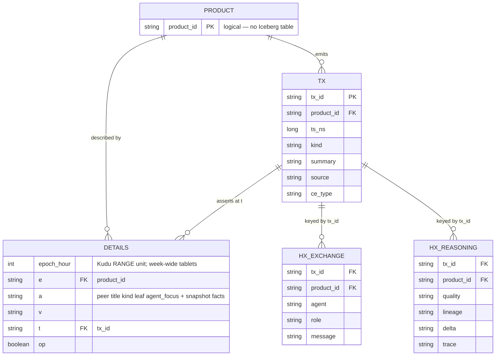

# Data Products History

Top-line **History** is the federation inventory of autonomous data products,
viewed as **agents** understand them. OpenLineage remains the provenance
facet (Atlas `/api/v1`); it is not the nav label.

## Sole SoR: Iceberg on RustFS

Logical names stay **`details` / `tx` / `hx`**. Physical storage is **tiered**:

| Name | Store | Role |
|------|--------|------|
| `*_tier0` | Kudu on `$SIGNALS_DATA_ROOT/kudu` | Hot land; expire by **DROP RANGE PARTITION** |
| `*_tier1` | Iceberg on RustFS `s3a://signals-dataproducts/` | Settled; add `_tier2` when local disks fill |
| `details`, `tx`, `hx_*` | Impala **views** (`UNION ALL`) | Readers; Impala merges tiers |

Writers insert **tier0**. Time grain is **UTC hour**; each Kudu range is
**one week** (168 hours). After **4 weeks**, copy that week to tier1, verify,
then `DROP RANGE PARTITION` — never `DELETE` rows
([Kudu schema design](https://kudu.apache.org/docs/schema_design.html#range-partition-management)).
Hour is the range unit, not a second hash/range level. Iceberg is **not**
hour-partitioned (file explosion); `details_tier1` / `tx` / `hx` use product.

**Postgres `:5455` (devenv PostgreSQL 16 + AGE)** is administrative only
(Atlas graph, Ranger). It is **not** pglite. No product copies there.
`impala_fdw` stays
Kudu-only and is not the warehouse reader.

Schema:

- [`data-products-kudu.sql`](../../../config/platform/data-products-kudu.sql)
- [`data-products-iceberg.sql`](../../../config/platform/data-products-iceberg.sql)
- [`data-products-views.sql`](../../../config/platform/data-products-views.sql)

`details` is a fact log `(e, a, v, t, op)` plus `epoch_hour` (range unit).
`t` / `tx_id` is RFC 9562 **UUIDv7** (time-ordered). Non-v7 ids are refused
and surfaced to the source via `Engine/Remediate` (`TX_ID_NOT_UUIDV7`).
Current inventory = latest assert per `(e, a)` over the **view**.



`config/platform/data-products.json` is a **bootstrap seed** for a first
tier0 `tx` + `details` assert, then retired as SoR. Local JSONL under
`build/state/` is lab scratch only — never a copy of the warehouse.

Object IO is RustFS (`/raid/signals/rustfs`, S3 `:9010`). Impala
`core-site.xml` uses `s3a://signals-dataproducts/` — not `/tmp`.

## First product: Metaflow run snapshots

`signals.metaflow.snapshots` is the first Signals-owned data product. Metaflow
already retains an immutable **code + data + deps** triple per run; we do not
re-snapshot. We **map** that triple into `details` and refuse any datastore
that is not RustFS.

| Metaflow | `details` fact (`e` = product) | Meaning |
|----------|--------------------------------|---------|
| `current.flow_name` / `run_id` | `flow_name`, `run_id`, `pathspec` | Run identity |
| code package URL / sha | `code_package`, `code_package_sha` | Immutable source tarball |
| `{sysroot}/{flow}/data` (CAS) | `data_uri` | Content-addressed artifacts |
| `{sysroot}/{flow}/{run}` | `snapshot_uri` | Run prefix (task metadata + pointers) |
| `@conda` / `@pypi` / default | `deps` | Environment lock (empty = default) |
| YK proxy or `@kubernetes` | `yk_app_id`, `yk_queue` | Admission claim |
| platform profile | `datastore`, `datastore_root`, `rustfs_endpoint` | Must be `s3://metaflow/` @ `:9010` |

Each run is a `tx` (`kind=snapshot`, `source=metaflow`). Latest-wins on
`latest_*` shows the current run; **run-qualified** keys
`run.{flow}/{run_id}.*` keep every retained snapshot in the projection so
ACP can see the net set, not only the last write.

Fail closed: `METAFLOW_DEFAULT_DATASTORE=local` (or unset, or a non-RustFS
endpoint / bucket) is a warehouse error. Profile:
`config/metaflow/platform.json` (`s3://metaflow/metaflow` @ RustFS `:9010`).

```bash
just record-snapshot DataProductTierUpkeep 42 \
  --code-package s3://metaflow/metaflow/DataProductTierUpkeep/data/abc \
  --code-sha abc
uv run python -m signals.ops review-product signals.metaflow.snapshots
```

The product **includes the ACP assessment**, not only the object URIs.
An observer (`acp-observer`) walks `data-product.history-review` and
writes `quality` / `lineage` / `delta` on `hx_reasoning` plus details
facts `assessment`, `upkeep_nominal`, `upkeep_fsm`. The job is narrow:
**observe `data-product.tier-upkeep` and confirm it is proceeding
nominally** (legal FSM — holding is neither failed nor done — ADD next
week, settle only weeks ≥ 4 weeks old via `DROP RANGE PARTITION`,
snapshot on RustFS). Off-nominal is recorded, then fail-closed.

`DataProductTierUpkeep.end` passes the walk `doc` into that assessment.

## Nascent products (seed)

| Product | Peer | Kind |
|---------|------|------|
| `signals.metaflow.snapshots` | Signals | Per-run snapshot (code, data, deps) |
| `gaius.cognition.outputs` | Gaius | Cognition |
| `gaius.prospects.corpus` | Gaius | Prospects SEC/FMP corpus (compact + summary on RustFS) |
| `aegir.usd-corpora` | Ægir | Corpus |
| `aegir.models.bespoke` | Ægir | Fine-tuned / bespoke models |
| `atelier.classification.embeddings` | Atelier | Classification parquet / embeddings |

## Events → agent

CloudEvent type: `dev.signals.dataproduct.updated`.

On create / update / maintain, walk method `data-product.history-review`:

1. `event_received` → `reviewing` → `understood`
2. Activate ACP: **Grok-Subscription** (`root.external.subscription.rate-limited`)
   or **Grok-Local** with Qwen3.8 `capability=[thinking,vision]`
3. Brief must cover **quality**, **lineage**, and **delta** (and
   **nominal** for `signals.metaflow.snapshots`)
4. Persist a `tx` + `details` asserts; persist agent work on `hx_*` keyed to `tx_id`

```bash
uv run python -m signals.ops review-product gaius.cognition.outputs \
  --kind updated --summary 'article-curate run 18'
```

`review-product` writes **tier0** (Kudu). JSON catalog is seed only. ACP
spawn is the next hop; `hx` is how History stays agent-facing.

Partition upkeep is method `data-product.tier-upkeep` (Metaflow flow,
Airflow schedule). It surfaces on YK `root.platform` as proxy sentinel
`signals-dataproduct-tier-upkeep`, or as a real Application if a step is
a K8s pod.

```bash
just rebuild              # Polarisfork assemble + restart + wait :8182
just polaris-install      # assemble only
```

UI: `/history` (nav **History**). `/lineage` redirects here. The page is a
**reader** of the warehouse, not a catalog editor.

Peers that maintain their own product on this warehouse: [Peer data
products](../operations/peer-data-products.md).
