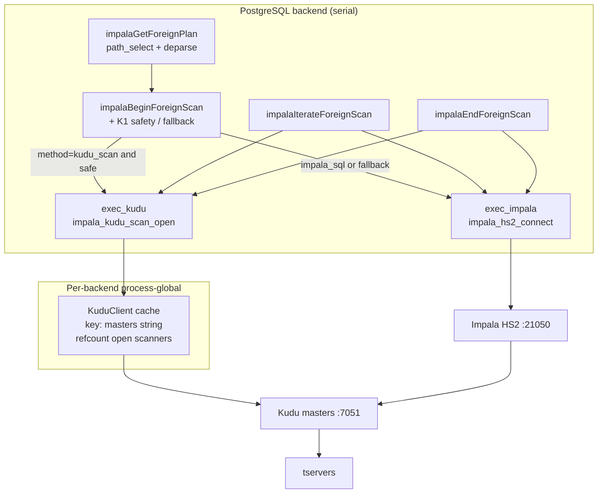
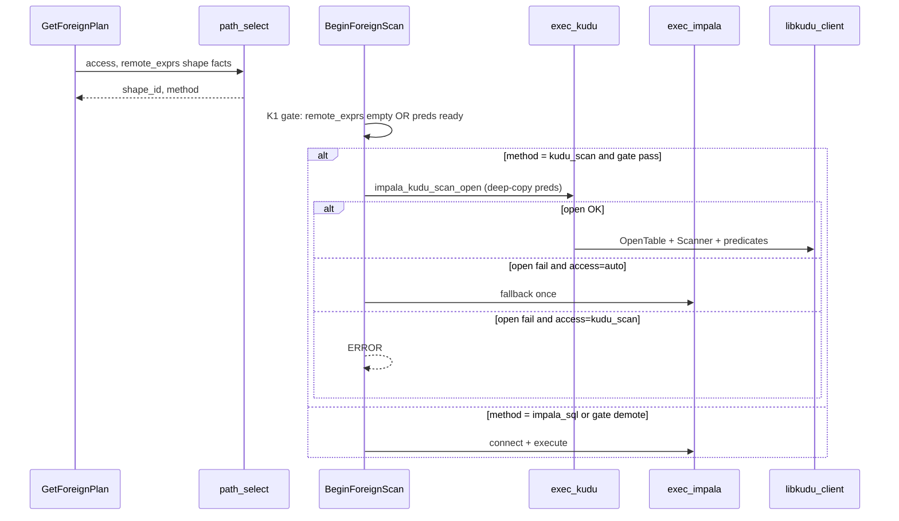

# Direct-to-Kudu FDW Enhancements (`kudu_scan`) for impala_fdw

| Field | Value |
|-------|--------|
| **Document** | Design: `kudu_scan` access method for impala_fdw |
| **Author** | signals / impala_fdw |
| **Date** | 2026-08-07 |
| **Status** | Draft rev 0.2 |
| **Canonical SPEC** | [`components/impala_fdw/docs/SPEC.md`](../components/impala_fdw/docs/SPEC.md) v0.4 (+ planned v0.4.1 delta note, § below) |
| **Elevates** | [`components/impala_fdw/docs/kudu_scan.md`](../components/impala_fdw/docs/kudu_scan.md) |
| **Scratch plan** | [`docs/scratch/2026-08-07/215809_kudu-scan-plan.md`](../docs/scratch/2026-08-07/215809_kudu-scan-plan.md) |

---

## Overview

`impala_fdw` is a PostgreSQL foreign-data wrapper for **Kudu-only** tables with a dual access path: **`impala_sql`** (HS2 thrift → Impala → Kudu) for general SQL, and **`kudu_scan`** (libkudu_client → Kudu) for closed governance query shapes. Phase 1a delivered projection, equality/range, IN/ANY, IS NULL, and AND pushdown on the HS2 path. The path selector already **promotes** some shapes to `kudu_scan`, but `impalaBeginForeignScan` **silently demotes** that choice and always runs HS2:

```c
/* components/impala_fdw/src/impala_fdw.c ~517–525 */
if (festate->method == IMPALA_FDW_ACCESS_KUDU_SCAN)
{
    elog(DEBUG1, "impala_fdw: kudu_scan not implemented; using impala_sql ...");
    festate->method = IMPALA_FDW_ACCESS_IMPALA_SQL;
}
```

Frontier harness measurements on Atlas adjacency tables (`atlas_edge_out` / `atlas_edge_in`) showed a **~2.5 s/hop floor** under correct IN/ANY pushdown and tiny frontiers: batch size does not help because HS2 session/planning tax dominates. This design implements a real **`exec_kudu`** executor so promoted shapes reach Kudu in **tens of milliseconds**, with semantic equivalence to HS2 on frozen seed data, shared type mapping, client caching, and a single fallback-to-HS2 policy when `access=auto`.

**Rev 0.2** tightens PR-K1 safety (no unfiltered scan when quals exist), replaces the over-broad `exprs_look_like_pk_eq` promotion story with a deliberate SPEC delta for Atlas v1, adds a full FFI memory contract, typed predicate compile algorithm, split include/lib build paths, ReadMode/timeouts/parallel policy, and freezes the v1 type set to Atlas projection columns.

---

## Background & Motivation

### Product topology (binding)

```
PostgreSQL (:5455)
  ├─ AGE / Atlas graph (atlas_graph)          ← SoR
  ├─ signals_catalog
  └─ impala_fdw
        ├─ impala_sql ──HS2──► Impala (:21050) ──► Kudu (:7051)
        └─ kudu_scan  ───────► libkudu_client ──► Kudu (:7051)
```

Atlas typed projections (freeze + outbox) are the primary consumers of the fast path:

| Projection | PG foreign table | Keys | Typical shape (correct id) |
|------------|------------------|------|----------------------------|
| `atlas.entity_flat` | `atlas_entity_flat` | BINARY `guid` PK | `gov.pk_lookup` (full PK eq) |
| `atlas.entity_by_qn` | `atlas_entity_by_qn` | BINARY `qn_digest` PK | `gov.unique_lookup` / `gov.pk_lookup` |
| `atlas.edge_out` / `edge_in` | `atlas_edge_out` / `_in` | **hex32 STRING** composite PK; HASH on `src`/`dst` | IN on HASH lead → **`gov.filtered_scan`** (not pk_lookup) |
| `atlas.entity_classifications` | … | PK `(tag_name, guid)` | full PK → pk_lookup; else filtered |
| `atlas.entity_audit` | … | PK `(guid, event_ts, seq)` | filtered / sample |

Edge keys are **hex32 STRING** because Impala cannot predicate on Kudu BINARY (`Unsupported Kudu type considered for predicate: BINARY`). The Kudu client path **can** predicate BINARY; hex32 remains for HS2 parity. DDL: `config/atlas/kudu_projections.sql`; FTs: `config/atlas/kudu_projections_fdw.sql` (currently force `access=impala_sql`).

### Current implementation state (phase 1a done)

| Component | Path | Role |
|-----------|------|------|
| FDW handlers | `src/impala_fdw.c` | Plan/Begin/Iterate/End/Explain; **kudu demote stub** |
| Path selector | `src/path_select.c` / `.h` | Shape id + method (SPEC §6–§7); **over-broad stub** (any `=` / IN → `gov.pk_lookup`) — **not normative** |
| Pushdown | `src/deparse.c` / `.h` | Classify + deparse SQL; eq/range/IN/ANY/NULL/AND |
| HS2 executor | `src/exec_impala.cpp` / `.h` | C ABI: connect / execute / fetch / close |
| Kerberos helpers | `src/krb_util.c` / `.h` | Principal resolution (HS2-focused) |
| Build | `Makefile`, devenv `impala-fdw:build` | PGXS + thrift; **no libkudu_client yet** |

**libkudu_client is already on the machine (verified layout):**

| Artifact | Location |
|----------|----------|
| Shared client **lib** | `.devenv/impala/lib/libkudu_client.so` → Impala toolchain `kudu-879a8f9e2/debug/lib/` |
| Headers (**not** under `.devenv/impala/`) | `components/impala/toolchain/toolchain-packages-gcc10.4.0/kudu-879a8f9e2/{debug,release}/include/kudu/client/client.h` |
| Headers (source) | `components/kudu/src/kudu/client/client.h` |
| Static (submodule) | `components/kudu/build/release/lib/libkudu_client.a` |

Note: `.devenv/impala/` has **no** `include/` tree — build must split **libdir** vs **incdir** (see Build / link).

### Pain points

1. **Latency floor:** ~0.1–2.5 s per frontier hop on HS2 even with correct pushdown; fixed session + Impala plan cost.
2. **False EXPLAIN:** `Impala AccessMethod: kudu_scan(fallback=impala_sql)` when planner chose Kudu but executor always runs HS2 (`impalaExplainForeignScan` ~691–694).
3. **BINARY asymmetry:** HS2 cannot usefully filter BINARY PKs; governance hydrate on `entity_flat` / `entity_by_qn` needs either hex workarounds or direct Kudu.
4. **No client cache design:** Opening Kudu clients per hop would reintroduce fixed tax; must be process-global per backend.
5. **Stub selector over-promotion:** live `exprs_look_like_pk_eq()` is not SPEC §6.2; must not remain the auto-promotion rule.

### Why now (decision)

Pull `libkudu_client` / `kudu_scan` **forward before** more HS2 pooling or TC tables. Pooling amortizes connection setup but not Impala planning per hop; measured data says the win is direct tablet RPCs for closed shapes.

---

## Goals & Non-Goals

### Goals

| ID | Goal | Success signal |
|----|------|----------------|
| **K1** | Sub-100 ms (local: tens of ms preferred) for full-PK lookup and small IN hops on `atlas_edge_*` | hop1 **&lt; 50 ms**; B=32 hop **&lt; 100 ms** |
| **K2** | Same pushable predicate algebra as phase-1a HS2 | eq/ne/lt/le/gt/ge, IN/ANY, IS NULL/NOT NULL, AND, projection, LIMIT |
| **K3** | BINARY and STRING keys first-class on kudu path | bytea ↔ BINARY raw; text hex32 ↔ STRING |
| **K4** | Shared type map; one FDW, two executors | same PG input form into slots (`\x` hex for bytea) |
| **K5** | `access=auto` promotes closed shapes under **strict rules**; **one** fallback to `impala_sql` on eligible Kudu error unless forced | no silent demote when forced `kudu_scan`; no unfiltered scan when quals exist |
| **K6** | No Impala required for promoted shapes | masters/tservers only for kudu_scan |
| **K7** | EXPLAIN shows planned method, shape, table, preds; ANALYZE shows effective method | plan-time vs runtime fallback distinguished |

### Non-goals

| ID | Non-goal | Rationale |
|----|----------|-----------|
| **N1** | DML via Kudu client | Outbox worker uses Impala UPSERT / separate writer |
| **N2** | Full SQL (joins, OR, expressions) on kudu path | Stay on `impala_sql` |
| **N3** | Replacing AGE Cypher | AGE remains SoR for graph |
| **N4** | Multi-tenant isolation inside FDW | SPEC D5 / §11.1 |
| **N5** | Perfect cost model / statistics | Flat costs OK for closed shapes |
| **N6** | Iceberg / non-Kudu storage | SPEC G6 |
| **N7** | Kerberos Kudu as gate for latency proof | PR-K5 later; nosasl first |
| **N8** | Full Kudu type matrix beyond Atlas projections | Freeze v1 types to freeze DDL |
| **N9** | Parallel-safe foreign paths / scan tokens | Serial backend only |

### Success metrics (devenv, single tserver)

| Metric | Baseline (HS2) | Target (`kudu_scan`) |
|--------|----------------|----------------------|
| Frontier hop1 (1 id) | ~0.1–2.5 s | **&lt; 50 ms** |
| Hop B=32, ~5–20 ids | ~2.5 s | **&lt; 100 ms** |
| Correctness | — | 100% row multiset match vs HS2 on **frozen** seed graph (no concurrent writers) |
| EXPLAIN adjacency hop | impala_sql (or false kudu fallback) | **true** planned `kudu_scan` under auto after PR-K3 |

---

## Key Decisions

| # | Decision | Choice | Rationale |
|---|----------|--------|-----------|
| **KD1** | Why now | Implement `kudu_scan` before HS2 pool / TC | Harness: fixed HS2 cost dominates; pushdown already correct |
| **KD2** | Product shape | One FDW, two executors (`exec_impala` + `exec_kudu`) | SPEC G4; shared types/options; no second extension |
| **KD3** | Scope v1 | Read-only scan; closed predicates only | Match SPEC §6; DML is outbox/Impala |
| **KD4** | Scanner model | `KuduScanner` + conjunct predicates (not scan tokens) | Serial Iterate; frontier hops tiny + HASH-pruned |
| **KD5** | Client lifecycle | Per-backend process-global `KuduClient` cache by masters string; **not** shared across fork | Avoid per-hop open tax; parallel workers refuse kudu |
| **KD6** | Table name | `kudu_table` option or `impala::` + `database` + `.` + `table` | HMS-free convention; no Impala DESCRIBE in v1 |
| **KD7** | Edge key encoding (v1) | STRING hex32 for edges; BINARY for entity_flat/by_qn | HS2 parity on edges; schema DataType drives encode |
| **KD8** | Fallback | auto → log + one HS2 retry on **transient** errors; forced `kudu_scan` → hard ERROR | SPEC §12–§13; NotFound still may fallback once but WARNING |
| **KD9** | Predicate IR | C ABI `ImpalaKuduPred[]` with **typed** value payloads; open deep-copies to `KuduValue` | Clear FFI ownership |
| **KD10** | Auth stage | nosasl/local for PR-K0–K4; Kerberos client PR-K5 | Latency proof must not wait on S3 identity |
| **KD11** | Slot conversion | Reuse HS2 pattern: malloc C strings → `OidInputFunctionCall`; BINARY as `\x` hex | One conversion path; free-before-call / PG_TRY |
| **KD12** | TC table / pooling | Deferred until post-kudu measure (PR-K4) | Do not invest until hop_ms proven |
| **KD13** | Read consistency | v1: `READ_LATEST`; equivalence **only** on frozen seed; snapshot mode later | Avoid flaky multiset under concurrent UPSERT |
| **KD14** | Timeouts | Scanner **60s**; builder admin/rpc defaults **60s** / **30s** | Bound hung tserver; align with interactive gov paths |
| **KD15** | Auto-promotion (SPEC delta) | Full PK eq → `gov.pk_lookup`; HASH-lead eq/IN on allowlist → `gov.filtered_scan` + promote; never label incomplete PK as pk_lookup | Fix stub over-breadth; Atlas frontier is filtered_scan |
| **KD16** | Forced kudu + residuals | If any baserestrictinfo is not in `remote_exprs` (unpushable residual), forced `kudu_scan` → **ERROR** | No partial push pretending full remote filter |
| **KD17** | K1 safety gate | Refuse kudu_scan when `remote_exprs != NIL` until PR-K2 | Prevent silent full-table wrong results |
| **KD18** | `guid_encoding` option | **Dropped for v1** | Schema `DataType` from OpenTable only |
| **KD19** | Parallel safety | ForeignPath **parallel_unsafe**; no kudu in parallel workers | Fork+reactor undefined |

---

## Proposed Design

### Architecture





### Module layout (target)

```
components/impala_fdw/
  src/
    impala_fdw.c          # branch Begin/Iterate/End/Explain/ReScan; K1 gate; fallback
    path_select.c/h       # strict shape + promotion (replace stub heuristic)
    deparse.c/h           # shippability (unchanged algebra)
    kudu_pred.c/h         # NEW optional — impala_build_kudu_preds
    exec_impala.cpp/h     # existing HS2
    exec_kudu.cpp/h       # NEW — libkudu_client C ABI
    krb_util.c/h          # later: shared principal for Kudu
  sql/                    # + regression SQL for K2+
  Makefile                # KUDU_CLIENT_LIBDIR + KUDU_CLIENT_INCDIR
```

No new Python/Java in the backend. Matches SPEC §11.5 / §17.

### Shape recognition vs method promotion (normative)

**Do not** use live `exprs_look_like_pk_eq()` as normative policy. That stub remains temporary code until PR-K3 replaces it.

#### Atlas v1 HASH / identity allowlist

For auto promotion of selective scans without full-PK completeness, equated or IN-listed columns must be a subset of:

```text
{ src, dst, guid, qn_digest, entity_guid }
```

(Resolved after `kudu_column` rename.) These match Atlas freeze HASH leads / PKs. Tables outside Atlas may still use full-PK recognition once schema PK introspection exists; v1 may require full equality set from foreign-table PK knowledge or only allowlist columns.

#### Recognition → `shape_id` (binding)

| Condition (single baserel foreign scan) | `shape_id` |
|----------------------------------------|------------|
| All remote quals are **equality** on a **complete primary-key column set** (known for table; e.g. `guid`; or `(src,elabel,dst)` all present) | `gov.pk_lookup` |
| Equality on full unique key set (`qn_digest` alone for `entity_by_qn`) | `gov.unique_lookup` (or `gov.pk_lookup` if treated as single-col PK) |
| Equality and/or IN/ANY **only** on HASH-leading / allowlist columns, **not** complete composite PK (e.g. `src = ANY(...)` on `edge_out`) | **`gov.filtered_scan`** — **never** `gov.pk_lookup` |
| Other pushable AND of eq/range/IN/NULL on any columns | `gov.filtered_scan` |
| Simple LIMIT, quals empty or only pushable simple preds, LIMIT ≤ `sample_max` | `gov.column_sample` |
| Projection-only, no LIMIT, weak/no filter | `gov.projection_only` |
| Residual unpushable quals, joins, OR, unrecognized | `sql.general` |

Optional future id `gov.hash_prune` is **not** introduced in v1; HASH-prune hops stay under `gov.filtered_scan` to avoid SPEC proliferation. Revisit if metrics need a distinct shape string.

#### Promotion → `method` under `access=auto` (boolean table)

Promote to `kudu_scan` **iff all** of:

1. `impala_fdw.enable_kudu_scan` is on and build has `IMPALA_FDW_WITH_KUDU`.
2. Single baserel foreign path; no parallel worker (path is `parallel_unsafe`).
3. `local_exprs` / residual after classify is **NIL** (every baserestrictinfo is remote/pushable) — **except** `gov.column_sample` / projection-only with empty quals.
4. Shape is one of: `gov.pk_lookup`, `gov.unique_lookup`, `gov.column_sample`, or `gov.filtered_scan` where **every** equated/IN column ∈ allowlist **or** full PK set is equality-complete.
5. Predicate compile will succeed for all `remote_exprs` (after PR-K2; before PR-K2 see K1 safety).
6. Not `gov.projection_only` without LIMIT (stays `impala_sql`).
7. Not `sql.general`.

| Shape | auto method |
|-------|-------------|
| `gov.pk_lookup` | **kudu_scan** |
| `gov.unique_lookup` | **kudu_scan** |
| `gov.column_sample` | **kudu_scan** |
| `gov.filtered_scan` (allowlist or all-pushable + full remote) | **kudu_scan** |
| `gov.projection_only` | **impala_sql** |
| `sql.general` | **impala_sql** |
| Forced `access=kudu_scan` | kudu_scan or **ERROR** (KD16) |
| Forced `access=impala_sql` | impala_sql |

#### SPEC delta (deliberate, file as v0.4.1 note at K3)

SPEC §6.2 defines `gov.pk_lookup` as equality on a **complete** PK set (0..1 row). This design:

- Keeps that meaning for `shape_id`.
- Auto-promotes Atlas frontier IN-on-HASH as **`gov.filtered_scan`**, not pk_lookup.
- Defers Kudu schema PK introspection; uses allowlist + known freeze PK sets for Atlas tables.
- Adds GUC `impala_fdw.enable_kudu_scan` (additive to SPEC §10).
- Resolves Impala→Kudu name by convention / `kudu_table` only in v1 (SPEC §7.2 metadata optional later).

**Over-broad current stub must not remain normative** after PR-K3.

### PR-K1 safety gate (binding)

Until predicate compilation is implemented and tested (PR-K2):

```text
if method == kudu_scan AND remote_exprs != NIL:
  if access == kudu_scan (forced):
    ERROR "kudu_scan predicates not available in this build stage; empty WHERE only"
  else:  # auto or transitional
    LOG "kudu_scan deferred: remote quals present without pred support; using impala_sql"
    method = impala_sql
```

K1 allows **only**:

- Projection-only full table scan, and/or
- LIMIT-only (`gov.column_sample` with empty or no remote quals).

This is a **temporary safety gate**, not optional. Smoke tests must not use real frontier hops on kudu path before K2.

### Kudu table name resolution

| Source | Rule |
|--------|------|
| Table option `kudu_table` | Use as-is if non-empty |
| Else | `impala::` + `database` + `.` + `table` (HMS-free Impala convention) |
| Server option `kudu_masters` | Default `127.0.0.1:7051`; comma-separated list |

Examples:

- FT `OPTIONS (database 'atlas', table 'edge_out')` → Kudu table `impala::atlas.edge_out`
- Override `kudu_table 'impala::atlas.edge_out'` if Impala naming diverges

Validator already accepts `kudu_masters` (server) and `kudu_table` (table); **runtime currently ignores them** — PR-K1 wires read in Begin.

**OpenTable NotFound messages (operator-facing):**

```text
impala_fdw: Kudu OpenTable failed for "impala::atlas.edge_out" on masters "127.0.0.1:7051": <status>
HINT: set foreign table option kudu_table to the exact Kudu name; verify with Impala SHOW CREATE TABLE
```

Do **not** cache negative OpenTable results forever; optional short TTL (e.g. 30s) or no negative cache in v1.

### Client and table cache

```text
Key:   canonical masters string (split on ',', trim, sort, rejoin)
Value: { shared_ptr<KuduClient>, open_scanner_refcount }
Scope: process-global static map + std::mutex  (per PG backend process)
Open:  KuduClientBuilder
         .master_server_addrs(...)
         .default_admin_operation_timeout(MonoDelta::FromSeconds(60))
         .default_rpc_timeout(MonoDelta::FromSeconds(30))
         .Build(&client)
Table: OpenTable per scan in K1; optional name→shared_ptr cache in K3 with NotFound refresh
```

Rules:

1. **Do not** construct a new client per hop / per ForeignScan.
2. Scanner is **per scan** (Begin → End); close scanner in End; decrement refcount; **never destroy client while any scan handle is open**.
3. **Parallel workers:** mark foreign paths `parallel_unsafe`. If somehow entered as parallel worker, refuse kudu_scan (ERROR or demote to impala_sql if auto). **Never** inherit / reuse a pre-fork `KuduClient` (reactor threads + fork = undefined).
4. Client is thread-safe for concurrent OpenTable from multiple scans in one backend; **scanners are not shared**.
5. Meta-cache of tablet locations is internal to `KuduClient` (process-lifetime); FDW does not manage tablet cache.

### Timeouts and error taxonomy

| Setting | Default | Notes |
|---------|---------|-------|
| `KuduClientBuilder::default_admin_operation_timeout` | **60 s** | OpenTable / admin |
| `KuduClientBuilder::default_rpc_timeout` | **30 s** | Per RPC |
| `KuduScanner::SetTimeoutMillis` | **60000** | Whole scan Open+Next budget |

| Error class | Examples | Forced `kudu_scan` | `access=auto` |
|-------------|----------|--------------------|---------------|
| Config / permanent | OpenTable NotFound, schema type mismatch, unpushable forced quals | ERROR | WARNING + **one** HS2 fallback (may also fail) |
| Auth | NotAuthorized, negotiation fail | ERROR | fallback once (lab: rare) |
| Transient | timeout, unavailable, leadership flap, network | ERROR | fallback once |
| Pred compile fail | empty IN handled specially; bad Oid | ERROR | demote to HS2 without opening Kudu |

### ReadMode / consistency (KD13)

| Mode | v1 choice |
|------|-----------|
| `KuduScanner::SetReadMode` | **`READ_LATEST`** (default Read Committed) |
| Fault-tolerant / snapshot | **Not set** in v1 |
| Equivalence tests | **Frozen seed only** — no concurrent outbox UPSERTs during multiset compare |
| Product later | Consider `READ_AT_SNAPSHOT` (+ optional fault-tolerant); document intentional delta vs Impala if any |

Under concurrent writers, HS2 vs kudu_scan multisets may diverge without either path bugging — do not treat that as a regression in K4 gates.

### Predicate compilation

Input: `remote_exprs` from `fdw_private` (`FdwPrivateRemoteExprs`).

#### High-level PG → Kudu map

| PG / deparse form | Kudu API |
|-------------------|----------|
| `col = c` | `NewComparisonPredicate(col, EQUAL, value)` |
| `col <> c` | `NOT_EQUAL` |
| `col < / <= / > / >= c` | matching `ComparisonOp` |
| `col IN (...)` / `= ANY(array)` | `NewInListPredicate` |
| `col IS NULL` / `IS NOT NULL` | `NewIsNullPredicate` / `NewIsNotNullPredicate` |
| AND of above | multiple `AddConjunctPredicate` |

**Not supported:** OR, expressions, Params (v1), joins, LIKE.

#### `impala_build_kudu_preds` algorithm

```text
function build_preds(rel, remote_exprs) → (preds[], n) or FAIL:

  out = empty list
  for each expr in remote_exprs:
    flatten_and_append(expr, out)   # see below
  return out

function flatten_and_append(node, out):
  switch NodeTag(node):
    BoolExpr AND:
      for each arg: flatten_and_append(arg, out)   # nested AND OK; OR → FAIL
    OpExpr:
      normalize to (Var foreign, op, Const):
        if Const left / Var right: flip op (< ↔ >, etc.)  # match deparse.c ~416–431
        if either side not Var|Const or both non-Const: FAIL
        if Const is NULL: FAIL (use NullTest; do not emit col = NULL)
        col = resolve_kudu_column(rel, Var)  # attname or kudu_column option
        append ImpalaKuduPred{ col, op, nvalues=1, typed value from Const }
    ScalarArrayOpExpr:
      require opname "=" and useOr == true; else FAIL
      left = foreign Var; right = Const array OR ArrayExpr of Consts
      if empty array / nvalues==0:
        mark scan as empty_result (no Kudu RPC; Iterate returns done immediately)
      else:
        col = resolve_kudu_column(...)
        append KUDU_PRED_IN with nvalues + typed values
        soft cap: if nvalues > 4096 → FAIL (force HS2 / ERROR)  # frontier B=256 safe
    NullTest:
      arg = foreign Var; op = IS_NULL / IS_NOT_NULL
      append pred; no values
    RelabelType:
      recurse into arg
    default:
      FAIL
```

`resolve_kudu_column(rel, var)`:

1. Look up `Form_pg_attribute` for `varattno`.
2. If column option `kudu_column` set on that att → use it (SPEC §5.4).
3. Else `NameStr(attname)`.

#### Typed value encode (C++ at open, from pred payload)

**Do not** pass decimal text for integers as the long-term contract. Pred struct carries typed payload:

```c
typedef struct ImpalaKuduPred {
  const char      *column;
  ImpalaKuduPredOp op;
  int              nvalues;
  unsigned int     value_type;   /* PG Oid of Const */
  /* Parallel arrays length nvalues; unused for IS_NULL ops */
  const void     **value_ptrs;   /* points into palloc'd copies of Datum payload */
  int             *value_lens;   /* BYTEA length; 0 for fixed types */
  bool            *value_isnull; /* should be false for cmp/IN after Const null check */
} ImpalaKuduPred;
```

| PG Oid | Storage in value_ptrs | Kudu factory (after schema check) |
|--------|----------------------|-----------------------------------|
| BOOLOID | `bool` | `KuduValue::FromBool` |
| INT2OID | `int16` | `FromInt` (INT16/INT8 col) |
| INT4OID | `int32` | `FromInt` |
| INT8OID | `int64` | `FromInt` |
| FLOAT4OID / FLOAT8OID | float/double | `FromFloat` / `FromDouble` |
| TEXTOID / VARCHAROID | utf8 bytes + len | `CopyString` → STRING |
| BYTEAOID | raw bytes + len | `CopyString` → BINARY |

At `impala_kudu_scan_open`:

1. OpenTable; read column `DataType` for each pred column.
2. Coerce: PG smallint/int may bind to Kudu INT8 (TINYINT `state`) if in range; else ERROR.
3. Reject: bytea against STRING without explicit conversion (no silent hex); text against BINARY.
4. Build `KuduValue*` / `KuduPredicate*`; **`AddConjunctPredicate` takes ownership** of the predicate (and values as documented by client.h). Do not free those after add.
5. **Deep-copy** all pred bytes into Kudu objects before return; caller may pfree pred IR immediately after open returns.

#### Empty IN

If IN/ANY has **zero** elements: set scan flag `empty_result=true`; do not call Open/Next on scanner (or open with impossible predicate if preferred — prefer no RPC). `next` returns 0 immediately. Matches SQL semantics (empty IN is false).

### Projection and LIMIT

- **Projection:** `SetProjectedColumnNames` from `retrieved_attrs` (names via `resolve_kudu_column` / attname).
- **LIMIT:** `KuduScanner::SetLimit(n)` when `limit ≥ 0` (client.h ~3231); also stop in Iterate after N rows.
- K1: client-side LIMIT stop acceptable; wire SetLimit fully by K2/K3.

### v1 supported types (Atlas freeze only)

| Kudu type (projections) | PG foreign type | Notes |
|-------------------------|-----------------|-------|
| STRING | text | edge keys hex32; names; labels |
| BINARY | bytea | guid, qn_digest |
| INT8 (TINYINT) | smallint | `entity_flat.state` |
| INT64 (BIGINT) | bigint | timestamps, seq |
| BOOL | boolean | classifications.propagate |

**ERROR** on other Kudu types at open/scan (DECIMAL, UNIXTIME_MICROS as native, DATE, FLOAT unless added later). Atlas freeze does not require them for frontier path.

**Asymmetry (documented):** predicates take **raw** BYTEA; slot output emits `\x` hex for PG input — same as `bytes_to_pg_hex` in `exec_impala.cpp`.

Strings: assume UTF-8; non-UTF8 passed through as bytes for STRING columns (Kudu is byte-oriented).

### Row → TupleTableSlot

Mirror HS2 Iterate path (`impalaIterateForeignScan` ~562–625):

1. `impala_kudu_scan_next` returns malloc’d `char **values`, `bool *nulls`, `nfields` in projection order.
2. Copy cell data **out of `KuduScanBatch`** into malloc’d strings **before** return (batch invalidates prior row pointers on next NextBatch — client.h).
3. STRING → UTF-8 C string; INT/BOOL → text forms for PG input; BINARY → `\x` hex.
4. `OidInputFunctionCall` into slot; **`impala_kudu_scan_free_row` before return** even on success; on ERROR use `PG_TRY`/`PG_CATCH` or free-before-call so longjmp does not leak.

### Memory & lifetime contract

Binding rules for implementers:

| Object | Allocator | Lifetime | Notes |
|--------|-----------|----------|-------|
| `ImpalaKuduPred[]` + payloads from `impala_build_kudu_preds` | palloc (CurrentMemoryContext of Begin) | **Only for duration of `BeginForeignScan` call into open** | After `impala_kudu_scan_open` returns, C++ owns deep copies; caller may pfree preds immediately |
| Column name strings in preds | palloc or pointer into relcache | Same as preds | `open` must `std::string` copy names |
| `KuduValue*` / `KuduPredicate*` | Kudu heap | Owned by scanner after `AddConjunctPredicate` | Do not free after add; destroyed with scanner |
| `ImpalaKuduScan` handle | C++ `new` / malloc of outer struct | Begin → End (or ERROR cleanup) | Holds `unique_ptr<KuduScanner>`, shared client ref |
| Row `values` / `nulls` from `next` | **`malloc` / `free`** (match `exec_impala`) | One outstanding row; free every Iterate | Must not point into `KuduScanBatch` |
| Process client cache entry | C++ static | Backend process lifetime | Refcount open scanners; destroy client only at refcount 0 (optional never destroy) |
| ERROR / longjmp | — | EndForeignScan may not run | Register `MemoryContext` callback or `PG_TRY` in Begin/Iterate to `impala_kudu_scan_close` / free_row |

```text
open(preds):
  deep-copy each pred value into KuduValue using typed encode
  AddConjunctPredicate (ownership transfer)
  // preds IR may be freed by caller now

next():
  if need refill: NextBatch into owned batch buffer
  materialize current row cells into malloc strings
  return pointers; caller free_row before next next() or on error

close():
  scanner.Close(); drop scanner; dec client refcount
```

### Fallback policy

| `access` | Kudu open/scan failure |
|----------|------------------------|
| `auto` | LOG WARNING (resolved masters+table+err); **one** retry via `impala_sql`; then ERROR if HS2 fails |
| `kudu_scan` | ERROR immediately — **no** silent HS2 |
| `impala_sql` | Never open Kudu |

Set `festate->fell_back_to_hs2 = true` when fallback used.

### Lifecycle (scan)

```text
BeginForeignScan:
  if EXPLAIN_ONLY: return
  if IsParallelWorker(): refuse kudu (ERROR or auto→HS2)
  resolve options: host/port/auth, kudu_masters, kudu_table, access
  if method == KUDU_SCAN:
    # KD17 safety until preds ready:
    if remote_exprs != NIL AND NOT preds_implemented:
      forced → ERROR; else demote to HS2 with LOG
    if remote_exprs != NIL:
      ok = impala_build_kudu_preds(...); if !ok: forced ERROR else demote/ERROR
      if empty_IN: open empty scan handle
    s = impala_kudu_scan_open(...); pfree preds IR
    if s == NULL:
      if access == auto: fall through to HS2 (fell_back=true)
      else: ereport(ERROR, errdetail masters+table)
    festate->kudu = s; return
  sql = impala_build_select_sql(...); hs2 connect+execute

IterateForeignScan:
  if empty_result: return empty slot
  if kudu: next → slot with PG_TRY free_row
  else: HS2 fetch

ReScanForeignScan:
  kudu: close scanner; re-open with same args
  hs2: re-execute SQL

EndForeignScan:
  impala_kudu_scan_close / hs2 close
```

### EXPLAIN (K7) — plan-time vs runtime

| Context | Properties |
|---------|------------|
| **Plain EXPLAIN** (no Begin execution) | Planned `ShapeId`, planned `AccessMethod` (`kudu_scan` \| `impala_sql`), `AccessOption`, resolved `KuduTable` / masters (from options), predicate **summary from plan remote_exprs**, Remote SQL for HS2 plan |
| **EXPLAIN ANALYZE** / after scan | **Effective** AccessMethod: `kudu_scan`, `impala_sql`, or `kudu_scan→impala_sql` if `fell_back_to_hs2` |

**K7 does not claim** that plain EXPLAIN shows runtime fallback. Remove permanent false label `kudu_scan(fallback=impala_sql)` once executor is real; use arrow form only when fallback actually occurred (ANALYZE).

### Build / link

**Split paths (matches live tree):**

```make
# Library: devenv symlink farm OR toolchain lib
KUDU_CLIENT_LIBDIR ?= $(shell \
  if [ -f "$(CURDIR)/../../.devenv/impala/lib/libkudu_client.so" ]; then \
    echo "$(CURDIR)/../../.devenv/impala/lib"; \
  elif [ -n "$(IMPALA_TOOLCHAIN_PACKAGES_HOME)" ]; then \
    echo "$(IMPALA_TOOLCHAIN_PACKAGES_HOME)/kudu-$(or $(IMPALA_KUDU_VERSION),879a8f9e2)/debug/lib"; \
  fi)

# Headers: toolchain include (NOT under .devenv/impala)
KUDU_CLIENT_INCDIR ?= $(shell \
  if [ -n "$(IMPALA_TOOLCHAIN_PACKAGES_HOME)" ] && \
     [ -f "$(IMPALA_TOOLCHAIN_PACKAGES_HOME)/kudu-$(or $(IMPALA_KUDU_VERSION),879a8f9e2)/debug/include/kudu/client/client.h" ]; then \
    echo "$(IMPALA_TOOLCHAIN_PACKAGES_HOME)/kudu-$(or $(IMPALA_KUDU_VERSION),879a8f9e2)/debug/include"; \
  elif [ -f "$(CURDIR)/../kudu/src/kudu/client/client.h" ]; then \
    echo "$(CURDIR)/../kudu/src"; \
  fi)

ifeq ($(IMPALA_FDW_WITH_KUDU),1)
  ifeq ($(KUDU_CLIENT_LIBDIR),)
    $(error KUDU_CLIENT_LIBDIR unset — need libkudu_client.so)
  endif
  ifeq ($(KUDU_CLIENT_INCDIR),)
    $(error KUDU_CLIENT_INCDIR unset — need kudu/client/client.h)
  endif
  PG_CPPFLAGS += -I$(KUDU_CLIENT_INCDIR) -DIMPALA_FDW_WITH_KUDU=1
  SHLIB_LINK += -L$(KUDU_CLIENT_LIBDIR) -lkudu_client \
    -Wl,-rpath,$(KUDU_CLIENT_LIBDIR)
  OBJS += src/exec_kudu.o
endif
```

Prefer matching **debug** or **release** pair for lib+headers from the same `kudu-879a8f9e2/{debug,release}/` tree.

**devenv task `impala-fdw:build` concrete delta:**

```bash
export IMPALA_TOOLCHAIN_PACKAGES_HOME=...   # already used for kudu lib symlinks in devenv.nix
export IMPALA_KUDU_VERSION="${IMPALA_KUDU_VERSION:-879a8f9e2}"
export KUDU_CLIENT_LIBDIR="$PWD/.devenv/impala/lib"
export KUDU_CLIENT_INCDIR="$IMPALA_TOOLCHAIN_PACKAGES_HOME/kudu-${IMPALA_KUDU_VERSION}/debug/include"
# Prefer release include if debug headers missing:
# test -f "$KUDU_CLIENT_INCDIR/kudu/client/client.h" || INCDIR=.../release/include
export IMPALA_FDW_WITH_KUDU=1   # Linux only when both exist
# Darwin / missing client: leave IMPALA_FDW_WITH_KUDU unset → HS2-only build, no hard fail
make ... KUDU_CLIENT_LIBDIR=... KUDU_CLIENT_INCDIR=... IMPALA_FDW_WITH_KUDU=${IMPALA_FDW_WITH_KUDU:-}
```

**Darwin / no toolchain:** build **without** kudu (`IMPALA_FDW_WITH_KUDU` off); HS2-only; task must not hard-fail.

**Link preference:** shared `.so` from Impala toolchain ABI over static `.a` unless verified.

### Auth (staged)

| Stage | Behavior | PR |
|-------|----------|-----|
| Lab / CI (latency proof) | Plain `KuduClientBuilder` → masters; no SASL | K0–K4 |
| S3 product | Same principal as HS2; PR-K5 | **K5** |

### Integration with frontier harness

`scripts/atlas_frontier_bench.py`:

- Today: procedural hop with `src = ANY (ARRAY[...]::text[])` against FTs forced `access=impala_sql`.
- **PR-K4:** `--force-access {auto,kudu_scan,impala_sql}` via `ALTER FOREIGN TABLE`; freeze seed; no concurrent writers; write scratch JSON.

---

## API / Interface Changes

### New C ABI — `src/exec_kudu.h`

```c
/* exec_kudu.h — C API for direct Kudu scans (libkudu_client) */
#ifndef IMPALA_FDW_EXEC_KUDU_H
#define IMPALA_FDW_EXEC_KUDU_H

#ifdef __cplusplus
extern "C" {
#endif

#include <stdbool.h>
#include <stddef.h>
#include <stdint.h>

typedef struct ImpalaKuduScan ImpalaKuduScan;

typedef enum {
  KUDU_PRED_EQ = 0,
  KUDU_PRED_NE,
  KUDU_PRED_LT,
  KUDU_PRED_LE,
  KUDU_PRED_GT,
  KUDU_PRED_GE,
  KUDU_PRED_IN,
  KUDU_PRED_IS_NULL,
  KUDU_PRED_IS_NOT_NULL
} ImpalaKuduPredOp;

typedef struct ImpalaKuduPred {
  const char      *column;       /* Kudu column name (after kudu_column resolve) */
  ImpalaKuduPredOp op;
  int              nvalues;      /* 0 for null-tests; 0 also signals empty IN at higher layer */
  unsigned int     value_type;   /* PG Oid */
  const void     **value_ptrs;   /* typed payloads; see encode table */
  int             *value_lens;   /* BYTEA / string byte length */
} ImpalaKuduPred;

/*
 * limit: -1 = none.
 * err: on failure, malloc'd message (caller free); include masters+table when possible.
 * Pred IR is borrowed only for the duration of this call; deep-copied inside.
 */
ImpalaKuduScan *impala_kudu_scan_open(
    const char *masters,
    const char *kudu_table,
    const char **columns, int ncolumns,
    const ImpalaKuduPred *preds, int npreds,
    int64_t limit,
    char **err);

/* 1 = row, 0 = done, -1 = error. values/nulls malloc'd; free with free_row. */
int impala_kudu_scan_next(
    ImpalaKuduScan *s,
    char ***values, bool **nulls, int *nfields,
    char **err);

void impala_kudu_scan_free_row(char **values, bool *nulls, int nfields);
void impala_kudu_scan_close(ImpalaKuduScan *s);

#ifdef __cplusplus
}
#endif
#endif
```

### FDW state extension

```c
typedef struct ImpalaFdwScanState {
  /* existing HS2 fields ... */
  ImpalaHs2Session *hs2;
  ImpalaHs2Result  *result;
  /* NEW */
  ImpalaKuduScan   *kudu;
  char             *kudu_masters;
  char             *kudu_table_name;
  bool              fell_back_to_hs2;
  bool              empty_result;     /* empty IN short-circuit */
  bool              preds_ready;      /* build flag: PR-K2+ */
  int64_t           limit_count;
  int64_t           rows_emitted;
} ImpalaFdwScanState;
```

Also: `create_foreignscan_path(..., parallel_aware=false)` / mark path **parallel_unsafe**.

### Options (runtime)

| Object | Option | Default | Consumer |
|--------|--------|---------|----------|
| Server | `kudu_masters` | `127.0.0.1:7051` | kudu open |
| Server | `default_access` | product `auto`; devenv install `impala_sql` | path select |
| Table | `kudu_table` | `impala::{db}.{table}` | open table |
| Table | `access` | inherit | force method |
| Column | `kudu_column` | attname | pred + projection names |

**No `guid_encoding` in v1** (KD18) — schema DataType only.

**devenv install:** keep server `default_access 'impala_sql'`; flip Atlas FTs to `access 'auto'` only after K4 equivalence (micro-PR).

### GUCs

| GUC | Default | Use |
|-----|---------|-----|
| `impala_fdw.log_path_choice` | off | LOG shape + method at Begin |
| `impala_fdw.sample_max` | 1000 | cap column_sample LIMIT |
| `impala_fdw.kudu_scan_sel_threshold` | 0.1 | reserved; v1 uses allowlist not selectivity |
| `impala_fdw.enable_kudu_scan` | on | kill-switch → always HS2 |
| `impala_fdw.kudu_scanner_timeout_ms` | 60000 | optional override |

File SPEC v0.4.1 additive note for `enable_kudu_scan` when implementing K3.

---

## Data Model Changes

**No Kudu schema migrations for v1.** Freeze DDL stands.

Postgres FT options after promotion:

```sql
OPTIONS (
  database 'atlas',
  "table" 'edge_out',
  access 'auto',
  kudu_table 'impala::atlas.edge_out'  -- optional
);
```

Server should include `kudu_masters '127.0.0.1:7051'`.

Outbox unchanged (Impala UPSERT).

---

## Alternatives Considered

### A1. HS2 session pool only (no kudu_scan)

| | |
|--|--|
| **Idea** | Pool OpenSession; reuse connections; maybe prepared statements or Impala result caching / query options |
| **Pros** | No new native dep |
| **Cons** | Harness: planning/session tax still ~2.5 s/hop; pool and result cache do not remove Impala planner per distinct IN-list SQL |
| **Verdict** | **Reject as primary fix.** Optional later for `sql.general` |

### A2. Separate `kudu_fdw` extension

| | |
|--|--|
| **Verdict** | **Reject** — violates SPEC G4 |

### A3. Impala short-circuit / coordinator bypass

| | |
|--|--|
| **Verdict** | **Out of scope** |

### A4. Kudu scan tokens + multi-scanner fan-out

| | |
|--|--|
| **Verdict** | **Defer** — serial `KuduScanner` (KD4) |

### A5. Always-on kudu_scan for all single-table scans

| | |
|--|--|
| **Verdict** | **Reject** — Impala-first; closed-world only |

---

## Security & Privacy Considerations

| Concern | Behavior |
|---------|----------|
| Multi-tenancy | Out of scope |
| Auth (v1) | nosasl lab only |
| Auth (product) | Same principal as HS2 (PR-K5) |
| PG GRANT / RLS | Unchanged; no RLS push to Kudu |
| Secrets | Mapping / env only |
| Data plane | Read-only |
| Logs | Truncate IN-lists of guids at LOG |

---

## Observability

- Plan EXPLAIN: planned method + shape + table + pred summary.
- ANALYZE: effective method + fallback flag.
- `log_path_choice`: LOG shape/method at Begin.
- Counters (soft): `kudu_scan_ok`, `kudu_scan_fallback`, `kudu_scan_error`, `kudu_rows`.
- Harness: primary latency dashboard.

---

## Rollout Plan


| Stage | Control | Audience |
|-------|---------|----------|
| Build | `IMPALA_FDW_WITH_KUDU` (Linux when lib+headers present) | devenv |
| Projection smoke | FT `access=kudu_scan` + **empty WHERE** | K1 |
| Predicated forced | FT `access=kudu_scan` after K2 | dev |
| Auto | allowlist promotion after K3; FT `access=auto` after K4 | Atlas |
| Kill switch | GUC / FT `impala_sql` | rollback |
| Darwin | HS2-only build | CI hosts without client |

**Semantic gate:** frozen-seed multiset equality before FT default auto.

---

## Testing Strategy

| Layer | Test | Pass criteria |
|-------|------|---------------|
| Unit / small binary | `tools/test_kudu_pred` or SQL regression: each NodeTag from deparse walker | Golden ops + columns + kudu_column |
| Unit | Typed encode INT8/16/32/64, BOOL, STRING, BYTEA | Schema match |
| Unit | Empty IN → empty result no crash | 0 rows |
| Integration K1 | Projection/LIMIT only with forced kudu | Works; **with WHERE** → ERROR or HS2 |
| Integration K2 | Point get; IN hop | Multiset = HS2 on frozen seed |
| BINARY | entity_flat PK eq | kudu works |
| Harness K4 | `--force-access` | hop metrics + ≥10× |
| Negative | Forced kudu + OR residual | ERROR |
| Parallel | path not parallel-safe | no worker kudu |
| Build | Linux with client; Darwin without | load OK both |

Regression SQL files under `components/impala_fdw/sql/` or signals installcheck-style scripts for K2+.

---

## Risks and Mitigations

| ID | Risk | Sev | Mitigation |
|----|------|-----|------------|
| R1 | ABI / compiler skew | High | Toolchain matched lib+headers; pin `kudu-879a8f9e2` |
| R2 | Silent wrong results | High | K1 gate; equivalence before auto; schema-typed encode |
| R3 | Reactors + fork | Med | parallel_unsafe; no client across fork |
| R4 | Memory leaks / batch invalidation | Med | Memory contract; malloc row copy; PG_TRY |
| R5 | Wrong table name | Med | Operator HINT; resolved name in ERROR |
| R6 | Fallback masks misconfig | Med | WARNING on NotFound; metrics; forced never falls back |
| R7 | libstdc++ / rpath | Med | rpath to LIBDIR; ldd in build task |
| R8 | ReScan | Low | Re-open scanner |
| R9 | Concurrent UPSERT flaky equivalence | Med | Frozen seed only; READ_LATEST documented |
| R10 | K1 without gate | Critical | KD17 binding |

---

## Open Questions

1. **Auto default for Atlas FTs:** Flip `kudu_projections_fdw.sql` after K4 green (recommended micro-PR), not in K3 itself.
2. **Params:** Out of K0–K4 unless harness needs bind.
3. **OpenTable cache:** None in K1; optional weak cache in K3 with NotFound refresh / no permanent negative cache.
4. **Kudu auth API details for S3:** PR-K5 spike.
5. **Broader filtered_scan auto without allowlist:** deferred until selectivity GUC / PK introspection (phase 4). v1 = allowlist + full PK only.

---

## References

| Document / code | Role |
|-----------------|------|
| `components/impala_fdw/docs/SPEC.md` | Binding SPEC v0.4 |
| `components/impala_fdw/docs/kudu_scan.md` | Prior draft |
| `config/atlas/kudu_projections.sql` | Freeze DDL |
| `config/atlas/kudu_projections_fdw.sql` | Foreign tables |
| `scripts/atlas_frontier_bench.py` | Latency harness |
| `components/impala_fdw/src/impala_fdw.c` | Demote stub ~517; EXPLAIN ~691 |
| `components/impala_fdw/src/path_select.c` | Stub selector (replace in K3) |
| `components/impala_fdw/src/deparse.c` | Pushdown + op flip ~416–431 |
| `components/impala_fdw/src/exec_impala.cpp` | HS2 + `bytes_to_pg_hex` |
| `components/kudu/src/kudu/client/client.h` | Scanner, preds, SetLimit, ReadMode |
| `devenv.nix` | `impala-fdw:build`; `IMPALA_KUDU_VERSION` / toolchain kudu lib symlinks |
| `docs/current/src/components/kudu.md` | `impala::<db>.<table>` naming |

---

## PR Plan

Ordered, independently reviewable PRs.

### PR-K0 — Build wiring: link `libkudu_client`, stub `exec_kudu`

| | |
|--|--|
| **Title** | impala_fdw: link libkudu_client and stub exec_kudu |
| **Files** | `Makefile` (`KUDU_CLIENT_LIBDIR` / `KUDU_CLIENT_INCDIR`); `src/exec_kudu.h`; `src/exec_kudu.cpp` stub; `devenv.nix` `impala-fdw:build` export libdir+incdir+`IMPALA_FDW_WITH_KUDU` on Linux when present; Darwin skip |
| **Deps** | None |
| **Description** | Compile/link only when both lib and headers found. Stub open returns error “not implemented”. `ldd` smoke. No behavior change when kudu off. |
| **Exit** | Linux devenv: `.so` loads with kudu symbols; Darwin/missing: HS2-only build succeeds |

### PR-K1 — OpenTable + projection + **safety gate**

| | |
|--|--|
| **Title** | impala_fdw: kudu_scan projection/LIMIT-only with remote-qual gate |
| **Files** | `exec_kudu.cpp` (client cache, timeouts, READ_LATEST, OpenTable, Scanner, NextBatch copy-out); `impala_fdw.c` (Begin/Iterate/End/ReScan/Explain; **refuse kudu when remote_exprs non-empty**; read masters/table; parallel_unsafe) |
| **Deps** | PR-K0 |
| **Description** | Real open/next/close. **No predicates.** If forced kudu_scan + WHERE → ERROR; if auto + WHERE → keep HS2 with LOG. Smoke: `SELECT type_name, name FROM atlas_entity_flat` forced kudu, no WHERE. Client refcount + free_row contract. |
| **Exit** | Projection scan works; predicated plan cannot silently full-scan on kudu |

### PR-K2 — Predicates + typed encode + regression SQL

| | |
|--|--|
| **Title** | impala_fdw: kudu_scan predicate compilation |
| **Files** | `exec_kudu.cpp`; `kudu_pred.c/h` or deparse helpers; `sql/*` or `tools/test_kudu_pred`; docs hex32 vs BINARY |
| **Deps** | PR-K1 |
| **Description** | Full `impala_build_kudu_preds` algorithm; kudu_column; empty IN; soft IN cap 4096; schema DataType encode; SetLimit; equivalence on frozen seed vs HS2. |
| **Exit** | Frontier single-hop IN multiset matches HS2; entity_flat PK eq works |

### PR-K3 — Strict selector, auto promote, fallback

| | |
|--|--|
| **Title** | impala_fdw: strict shape promotion and HS2 fallback |
| **Files** | `path_select.c/h`; `impala_fdw.c` (remove silent demote; fallback; GUCs); SPEC v0.4.1 delta note (promotion + enable_kudu_scan); **not** FT default flip yet |
| **Deps** | **PR-K2** (must not promote predicated auto shapes without preds) |
| **Description** | Implement recognition/promotion tables (KD15); filtered_scan for HASH IN; full PK → pk_lookup; fallback taxonomy; EXPLAIN plan vs ANALYZE effective. |
| **Exit** | Auto hop with allowlist uses kudu_scan; forced never silent HS2; incomplete PK never labeled pk_lookup |

### PR-K4 — Measure + harden

| | |
|--|--|
| **Title** | impala_fdw: frontier bench kudu_scan before/after |
| **Files** | `scripts/atlas_frontier_bench.py` (`--force-access`); scratch JSON/MD; optional FT auto micro-follow-up; component docs |
| **Deps** | PR-K3 |
| **Description** | Frozen seed; publish HS2 vs kudu numbers; ≥10× gate; document READ_LATEST + types. |
| **Exit** | hop1 &lt; 50 ms; B=32 &lt; 100 ms; 100% match frozen seed |

### PR-K5 — Kerberos Kudu client (later)

| | |
|--|--|
| **Title** | impala_fdw: Kerberos authentication for kudu_scan |
| **Files** | `exec_kudu.cpp`; `krb_util.c`; docs |
| **Deps** | Soft: after K2; product after K4 |
| **Description** | Same principal as HS2 outbound. |
| **Exit** | Secured cluster kudu_scan as session user |

---

## Document history

| Ver | Date | Note |
|-----|------|------|
| 0.1 | 2026-08-07 | Elevated `kudu_scan.md`; grounded in phase-1a + harness |
| 0.2 | 2026-08-07 | Review fixes: K1 safety, SPEC-aligned promotion, memory contract, typed preds, split build paths, ReadMode/timeouts/parallel, Atlas type freeze, EXPLAIN plan vs runtime, KD13–KD19 |
